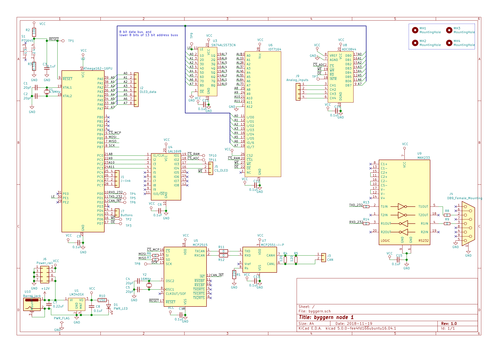
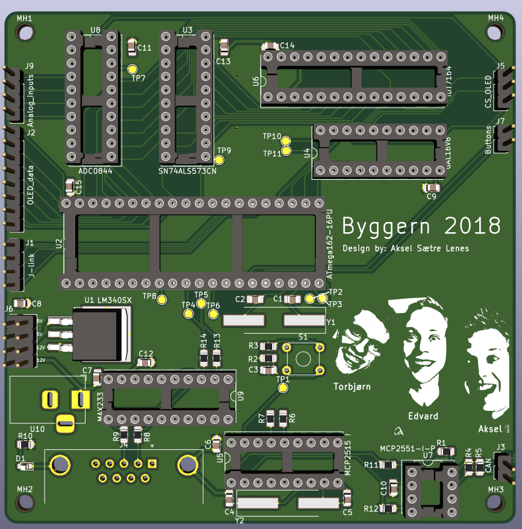

# byggern-PCB
Board that replaces node 1 in Embedded and Industrial Computer Systems Design project at NTNU. 

The two layer board is designed using [kicad](http://kicad-pcb.org/help/getting-started/) 

## Schematic
Download pdf version [here](./pictures/schematic.pdf)

## Rendering of board

